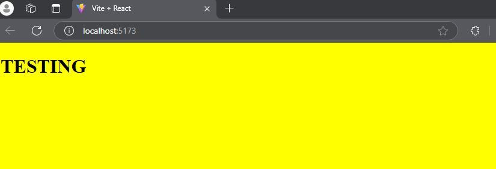

# Career Simulation (Core) BIT STORE

My project is BIT STORE, a store where users can acquire electronic items called bitItems. Users can register and log in to access the site. Token and hashed password encryption will be implemented to complete the login and registration experience.

Plan

To implement this, I'll create three tables in a PostgreSQL database: users, reviews, and items. These tables will allow me to perform Create, Read, Update, and Delete (CRUD) operations on the data.

Backend Structure

I plan to have the following files in my backend:

- client.cjs: This file will establish the connection with the database. I'll use npm pg for communication and dotenv to keep environment details private.

- seed.cjs: This file will create tables by default and introduce fake data to test the database based on CRUD tasks. Additional features will be added during the development process.

- user.cjs: This file will contain functions to create users using SQL commands. Users will be authenticated based on a username and password, along with a primary key ID and name. Additional features will be added during the development process.

- bititems.cjs: This file will contain functions to create bitItems using SQL commands. BitItems will be based on name, details, and prices. Additional features will be added during the development process.

- server.cjs: This file will manage endpoint routes for GET, POST, PUT, DELETE, and find items using params. Additional features will be added during the development process.

Frontend

I'll integrate the backend with the frontend using React.

Deployment.

The final project will be deployed using Render.com|

--------------------------------------
TESTING React Vite up and running
--------------------------------------

,


TESTING client.cjs up and running


after a cloned the project

i was avaible to connected seed.cjs

 

tablets was created connections is working fine,
sql command create tables is work fine as well.


install npm bycrypt packages to hash passsword of the user and
I was able to console.log the user input password and hashpassword as well.
i awas able to create a user from the seed.cjs file imported the function from
the users.cjs


on the database bititems -> tables user_card 
i was able to find the hash password,
 so far everything is working at this point 
 on postgres database.


on bititems.cjs i was able to query data into the table card_item
also console.log the fake data 


-------------
Server.cjs up and running 


###  postman Login ✅

---------------------------

```
http://localhost:3000/api/auth/login

{
    "username": "admin",
    "password": "admin"
}

```


###  postman Register ✅

---------------------------

```
http://localhost:3000/api/auth/register

{
    "username": "johnDoe",
    "password": "admin"
}

```


###  postman get item by ID ✅

---------------------------

```
http://localhost:3000/api/items/1

[
    {
        "id": 1,
        "name": "Red Card",
        "description": "fire card",
        "number": 2000
    }
]
```


###  postman get api/auth/me ✅

---------------------------

```
http://localhost:3000/api/auth/me


```


###  postman get /api/items ✅

---------------------------

```
http://localhost:3000/api/items


```


### issues with JWT and BEAR TOKEN 
GET /api/auth/me 🔒
----------------------
POST /api/items/:itemId/reviews 🔒

GET /api/reviews/me 🔒

it doent allow me to view the list on my Reviews 
because it 403 Forbidden error is return
right now i am trying to check postman how to get 
view list , the list working fine because i can console.log 
on my postgres terminal and it show the tablet with the data.....
 
